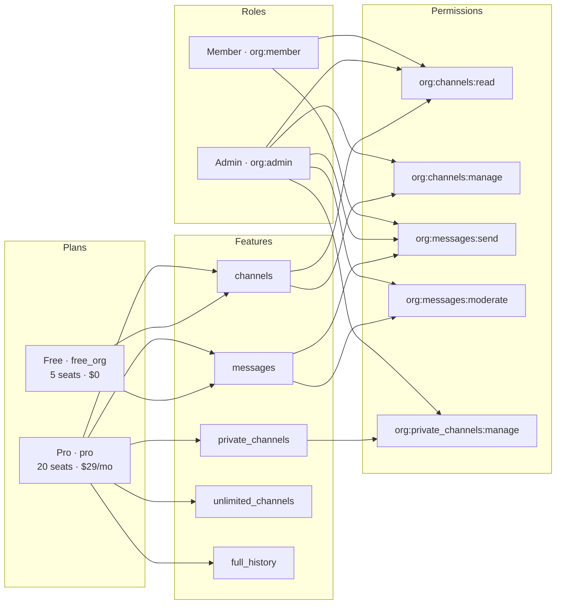
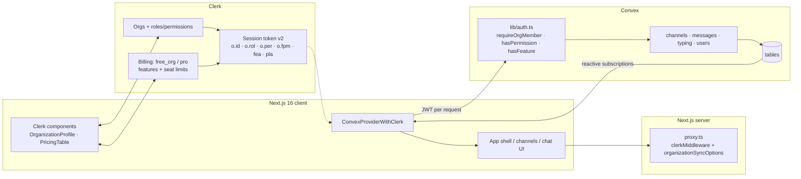
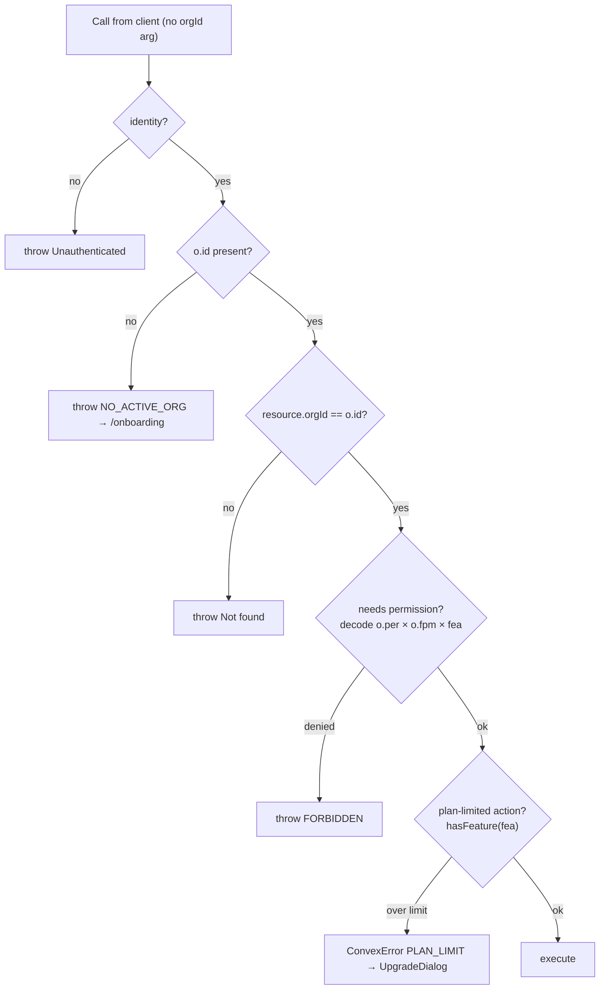
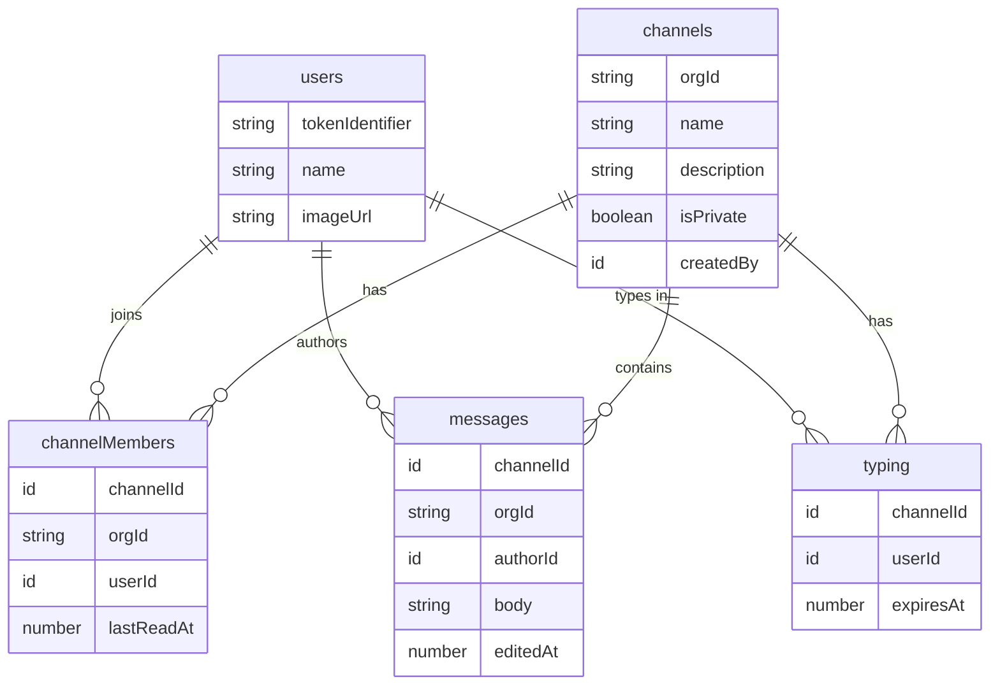
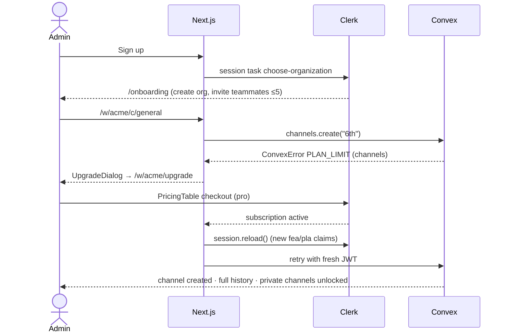

# Nook — B2B multi-tenant chat (Clerk + Convex + Next.js 16)

## Context
Nook is a fresh Next.js 16.3 app (React 19.2, Tailwind 4, shadcn `base-nova`) with Clerk wired in (`proxy.ts`, sign-in/up pages, `ClerkProvider` in `app/layout.tsx`) and Convex set up for Clerk JWTs (`convex/auth.config.ts`, `applicationID: "convex"`). There's no schema, no Convex client provider and no product UI yet. Two setup problems exist:
- **Fonts:** `app/globals.css:10` has `--font-sans: var(--font-sans)`, which points at itself, so the Geist font never applies.
- **ESLint 10 crash:** `eslint-plugin-react@7.37.5` calls `context.getFilename()`, which ESLint 10 removed. It happens in `resolveBasedir` when `settings.react.version` is `"detect"`. ESLint also lints `.agents/**` and `.claude/**`.

Goal: a Slack-like app where orgs (tenants) have channels and real-time messages. Clerk handles auth, orgs, RBAC, billing and feature gating. Convex handles data, real-time updates and **server-side enforcement**.

## Decisions (confirmed)
- Pro plan caps members at **20**, so the B2B add-on isn't needed. Clerk enforces the cap natively.
- On Free, older messages are **hidden, not deleted** (the latest 30 per channel are visible). Upgrading shows the full history right away.
- v1 extras: edit/delete own messages (admins can delete any), **private channels (Pro)**, typing indicators, unread badges.
- No Clerk CLI. You configure the Clerk Dashboard by hand using the checklist below.

## Feature matrix
| | Free (`free_org`, 5 seats) | Pro (`pro`, 20 seats) |
|---|---|---|
| Members | 5 (Clerk seat limit) | 20 (Clerk seat limit) |
| Channels | 5 | Unlimited |
| Visible history / channel | Last 30 | Full, paginated |
| Private channels | ✗ | ✓ |
| Create/delete channels | Admins | Admins |
| Join public channels, send/edit/delete own messages, typing, unread | All members | All members |

## Clerk Dashboard setup guide (you do this manually, in this order)

### How the pieces fit
Clerk builds a permission check out of **Plan → Features → Permissions → Roles**. With Billing on, a custom permission `org:<feature>:<action>` returns `true` only when both of these hold:
- the member's **role** includes the permission, **and**
- the org's **plan** includes a **feature** whose key is exactly `<feature>`.

That's why the permissions below are named after features. The "everyone" features (`channels`, `messages`) are in **both** plans, and the Pro-only permission (`private_channels`) only works on Pro.

`unlimited_channels` and `full_history` don't have permissions. They're **entitlement features**, checked with `has({ feature })` / the `fea` claim, and they apply to every role.

### Step 1 — Enable Organizations
Dashboard → **Organizations → Settings**
- **Enable organizations:** ON
- **Allow personal accounts:** OFF. Every user must be in an org, so after sign-up Clerk triggers the `choose-organization` session task and we send them to `/onboarding`.
- **Allow user-created organizations:** ON. You can leave the "organizations per user" limit at the default.
- **Default membership limit:** leave the default. Billing seat limits override it per plan.
- **Creator's initial role:** `org:admin`. **Default role for new members:** `org:member`.

### Step 2 — Enable Billing
Dashboard → **Billing → Settings**
- Enable **Organization billing**. User billing can stay off.
- Dev instances use Clerk's test payment gateway (card `4242 4242 4242 4242`). Before going to production, connect your own Stripe account here.

### Step 3 — Create Features
Dashboard → **Billing → Features → Create feature**. Enter each **Key** exactly as written, because code checks these strings.

| Name | Key | Description (shown on the pricing table) | Publicly visible |
|---|---|---|---|
| Channels | `channels` | Create, browse, and join topic-based channels for your team. | ✓ |
| Messaging | `messages` | Real-time messaging with edits, typing indicators, and unread badges. | ✓ |
| Private channels | `private_channels` | Invite-only channels that are hidden from the rest of your organization. | ✓ |
| Unlimited channels | `unlimited_channels` | Remove the 5-channel cap and organize every project, team, and topic. | ✓ |
| Full message history | `full_history` | Search and scroll through your entire message history, not just the latest 30 messages. | ✓ |

### Step 4 — Create custom Permissions
Dashboard → **Organizations → Roles & Permissions → Permissions tab → Create permission**. Clerk adds the `org:` prefix to the key. Pick the matching **Feature** when the form asks for it.

| Name | Key | Feature | Description |
|---|---|---|---|
| Read channels | `org:channels:read` | `channels` | View and join public channels in the organization. |
| Manage channels | `org:channels:manage` | `channels` | Create, rename, and delete channels, and manage channel membership. |
| Send messages | `org:messages:send` | `messages` | Post messages and edit or delete your own messages. |
| Moderate messages | `org:messages:moderate` | `messages` | Delete any member's messages to keep conversations on track. |
| Manage private channels | `org:private_channels:manage` | `private_channels` | Create private channels and choose who can access them (Pro). |

### Step 5 — Configure Roles
Dashboard → **Organizations → Roles & Permissions → Roles tab**. Edit the two default roles. Don't create new ones.

**Admin** — key `org:admin` (existing)
- **Description:** Workspace owner or manager. Manages members, billing, and channels, and can moderate any conversation.
- **System permissions:** keep all 8 checked: `org:sys_profile:manage`, `org:sys_profile:delete`, `org:sys_memberships:read`, `org:sys_memberships:manage`, `org:sys_domains:read`, `org:sys_domains:manage`, `org:sys_billing:read`, `org:sys_billing:manage`. The last three memberships/profile ones are required for the creator role.
- **Custom permissions:** ✓ all five (`channels:read`, `channels:manage`, `messages:send`, `messages:moderate`, `private_channels:manage`).

**Member** — key `org:member` (existing)
- **Description:** Regular teammate. Can browse and join public channels, chat in real time, and manage their own messages.
- **System permissions:** `org:sys_memberships:read` (see teammates) and `org:sys_billing:read` (see current plan). Nothing else.
- **Custom permissions:** ✓ `org:channels:read`, ✓ `org:messages:send`.

| Capability | Admin | Member |
|---|:-:|:-:|
| Invite/remove members, change roles | ✓ | ✗ |
| Change plan / payment method | ✓ | ✗ (sees plan only) |
| Browse & join public channels | ✓ | ✓ |
| Create / delete channels | ✓ | ✗ |
| Create private channels & add people (Pro) | ✓ | ✗ |
| Send, edit & delete own messages | ✓ | ✓ |
| Delete anyone's message | ✓ | ✗ |

### Step 6 — Create Organization Plans
Dashboard → **Billing → Plans → Organization Plans tab**. Plan type can't be changed later, so make sure you're on the **Organization** tab.

**Free**, the auto-created default org plan (edit it)
- **Name:** Free · **Key:** `free_org` (keep Clerk's default key)
- **Description:** For small teams trying Nook. Up to 5 members, 5 channels, and your 30 most recent messages per channel.
- **Monthly base fee:** $0 · **Default plan:** ✓ · **Publicly available:** ✓
- **Seat limit:** 5 (seat-based / membership limit ON)
- **Features:** `channels`, `messages`

**Pro** (create new)
- **Name:** Pro · **Key:** `pro`
- **Description:** For growing teams. Up to 20 members, unlimited channels, private channels, and full message history.
- **Monthly base fee:** **$29.00**. **Annual fee:** **$24.00/mo billed yearly ($288)**, about 17% off. Suggested pricing; change it if you like, because the code never reads prices.
- **Free trial:** optional, 14 days
- **Publicly available:** ✓ · **Seat limit:** 20. Seat limits can't be edited after creation, so double-check this one.
- **Features:** `channels`, `messages`, `private_channels`, `unlimited_channels`, `full_history`

| | Free | Pro |
|---|---|---|
| Price | $0 | $29/mo or $24/mo billed annually |
| Members (seats) | 5 | 20 |
| Channels | 5 | Unlimited |
| History visible per channel | Latest 30 | Everything |
| Private channels | — | ✓ |
| Real-time chat, typing, unread, edit/delete | ✓ | ✓ |

### Step 7 — Convex integration & env
- Dashboard → **Integrations → Convex**: activate it. This makes session tokens carry `aud: "convex"`, which matches `applicationID: "convex"` in `convex/auth.config.ts`.
- Convex env already has `CLERK_FRONTEND_API_URL`.
- `.env.local` needs `NEXT_PUBLIC_CLERK_PUBLISHABLE_KEY`, `CLERK_SECRET_KEY`, `NEXT_PUBLIC_CONVEX_URL` and `NEXT_PUBLIC_CLERK_SIGN_IN_URL=/sign-in`.
- Session token version must be **v2**, the default for new instances. That's what provides the compact `o`, `fea` and `pla` claims.

### Step 8 — Sanity check
Create an org, open the browser devtools, and run `await Clerk.session.getToken()`. Decode the token on jwt.io. You should see:
- `o.rol: "admin"`
- `o.per` containing `manage,moderate,read,send`
- `fea: "o:channels,o:messages"`
- `pla: "o:free_org"`

Phase 1 checks the same claims on the Convex side.

## Architecture

**Request authorization (every Convex function):**

**Auth claims in Convex:** `ctx.auth.getUserIdentity()` returns the v2 session token claims: `o.id`, `o.rol`, `o.per`, `o.fpm`, `fea`, `pla`. I'll add a helper in `convex/lib/auth.ts`:
- `requireOrgMember(ctx)` returns `{ user, orgId, role }`.
- `hasPermission(identity, "org:channels:manage")` (also used for `channels:read`, `messages:send`, `messages:moderate` and `private_channels:manage`) decodes `o.per` and `o.fpm` against `fea` using the bitmask algorithm from Clerk's docs.
- `hasFeature(identity, "full_history")` parses `fea`.

The client never sends `orgId` as an argument; it always comes from the token. **Phase 1 checks first** that the claims really arrive under these keys. If they don't, the fallback is a Convex JWT template with explicit claims (`org_id`, `org_role`, `org_permissions`, `features`).

**Member removal:** a user removed from an org loses `o.id` in their token, so access is revoked automatically and no webhook is needed. User profiles are upserted from identity when the user first calls in (`users.store`).

**Schema** (`convex/schema.ts`):
- `users`: tokenIdentifier, name, imageUrl. Index `by_token`.
- `channels`: orgId, name, description?, isPrivate, createdBy. Indexes `by_org`, `by_org_name`.
- `channelMembers`: channelId, orgId, userId, lastReadAt. Indexes `by_channel_user`, `by_org_user`.
- `messages`: channelId, orgId, authorId, body, editedAt?. Hard delete. Index `by_channel`.
- `typing`: channelId, userId, expiresAt. Index `by_channel`. A scheduled internal mutation cleans up expired rows.

**Convex functions:**
- `channels.ts`
  - `list`: public channels plus private channels you belong to, each with an unread count. Unread counts use a bounded read after `lastReadAt`, capped and shown as "99+".
  - `create`: needs `channels:manage`. Free orgs are capped at 5 channels (throws `ConvexError({code:"PLAN_LIMIT", limit:"channels"})`). `isPrivate` needs `org:private_channels:manage`, which only resolves on Pro. `join` needs `channels:read` and `send` needs `messages:send`.
  - `remove`: needs `channels:manage`. Deletes the channel's messages and memberships in batches via the scheduler.
  - `join` / `leave`: any member, public channels only.
  - `addMember`: private channels, admins only.
- `messages.ts`
  - `list`: paginated with `usePaginatedQuery`. Without `full_history`, the server returns only the newest 30 plus `{ historyHidden: true }`.
  - `send` / `edit` / `remove`: `remove` allows the author or `messages:moderate`.
  - `markRead`
- `typing.ts`: `heartbeat`, `list`

Every function checks that the channel's `orgId` matches the caller's token org.

**Next.js** (read `node_modules/next/dist/docs` first; Next 16 uses `proxy.ts`):
- `components/providers.tsx` wraps the app in `ConvexProviderWithClerk` (`convex/react-clerk`) using `useAuth`.
- `proxy.ts`: `clerkMiddleware` with `organizationSyncOptions` (`/w/:slug(.*)`), protecting everything except `/`, `/sign-in` and `/sign-up`.
- Routes:
  - `/`: landing page plus `<PricingTable for="organization"/>`
  - `/onboarding`: `<OrganizationList hidePersonal>` / `<CreateOrganization>`, then invite teammates
  - `/w/[slug]`: app shell with a sidebar (org switcher, channel list, unread badges, "3/5 channels" meter, `UserButton`)
  - `/w/[slug]/c/[channelId]`: message list, composer, typing indicator
  - `/w/[slug]/settings`: `<OrganizationProfile>` for members, invites (seat limit) and billing
  - `/w/[slug]/upgrade`: plan comparison plus `<PricingTable for="organization">`
- **Gating in the UI:** `<Show when={{ permission: "org:channels:manage" }}>` / `has({ feature })`, only as UX hints. The server is the source of truth.
- **Upgrade flow:** a shared `UpgradeDialog` opens on any `PLAN_LIMIT` ConvexError and from locked CTAs (history banner, private toggle, channel meter). After checkout, call `session.reload()` so the new `fea` claim reaches Convex straight away.
**User journey: onboarding → upgrade:**

- shadcn components (added via the shadcn skill/CLI): dialog, input, textarea, scroll-area, avatar, badge, dropdown-menu, sidebar, sonner, tooltip, skeleton.

## Phases (stop for your review after each one → commit + push after approval)
Work happens on branch **`feat/nook-mvp`**. After Phase 0 is approved and committed, I push and open a **draft PR** to `master`. Each later phase is a reviewed commit pushed to the same PR.

```mermaid
flowchart LR
  B["branch feat/nook-mvp"] --> P0["Phase 0<br/>tooling + providers"]
  P0 --> R0{{"your review"}} --> C0["commit + push<br/>open draft PR"]
  C0 --> P1["Phase 1<br/>schema + auth"] --> R1{{"review"}} --> C1["commit"]
  C1 --> P2["Phase 2<br/>channels + shell"] --> R2{{"review"}} --> C2["commit"]
  C2 --> P3["Phase 3<br/>messaging"] --> R3{{"review"}} --> C3["commit"]
  C3 --> P4["Phase 4<br/>billing gating"] --> R4{{"review"}} --> C4["commit"]
  C4 --> P5["Phase 5<br/>polish + README"] --> R5{{"review"}} --> C5["commit → PR ready"]
```

0. **Tooling fixes + foundation**
   - Fix fonts in `globals.css`: `--font-sans: var(--font-geist-sans)`.
   - `eslint.config.mjs`: set `settings.react.version: "19.2"`, ignore `.agents/**`, `.claude/**`, `convex/_generated/**`, and disable or override any other rule that breaks on ESLint 10 (no downgrades).
   - Add the Convex provider, `organizationSyncOptions` in the proxy, and `.env.example`.
1. **Data model + auth helpers:** schema, `lib/auth.ts` with the claim decoder, `users.store`, and the claim-shape check.
2. **Channels + app shell + onboarding:** CRUD, join/leave, RBAC, sidebar, org switch, onboarding and settings pages.
3. **Real-time messaging:** send/edit/delete, pagination, typing, unread/markRead.
4. **Billing & gating:** channel limit, history limit, private channels, upgrade page, `UpgradeDialog`, seat-limit messaging, session reload after checkout.
5. **Polish:** landing page, empty/loading states, responsive layout, README with setup and the Clerk checklist.

## Verification (minimal testing, as requested)
After each phase:
- `pnpm exec tsc --noEmit`
- `pnpm lint` (ESLint 10 must run cleanly)
- `npx convex dev --once` pushes without errors
- Browser pane (`nook-frontend` launch config): screenshots of the flow for that phase

Phase 4 end-to-end:
- As a Free admin, create a 6th channel → the upgrade dialog appears.
- Post more than 30 messages → the history banner appears.
- A second user, as a member, can't see the create-channel button, and calling the mutation directly is rejected.
- Invite a 6th member → Clerk blocks it.
- Upgrade in Clerk test mode → full history and private channels unlock without a reload.